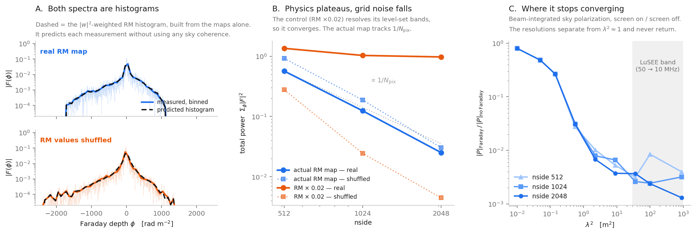

# The diffuse-sky Faraday ripple is the pixel grid

Numerical audit of the diffuse-sky Faraday result in `report/report.tex`
(Steps 2–4), carried out 2026-08-18 on branch `croissant-crosscheck`.

A formatted version with the same content is published at
<https://claude.ai/code/artifact/5565adda-6170-4410-8cea-a09527376645>.



---

## 1. Scope

The finding applies to one quantity: the beam-integrated polarization of the
**diffuse** sky after passing through a spatially structured Faraday screen.
Everything that does not involve a resolved RM gradient is unaffected.

| Component | Status | Why |
|---|---|---|
| Stokes I → 16 products | sound | Band-limited, deterministic |
| I → Q,U leakage | sound | No Faraday phase involved |
| Point source at one `φ_FD` | sound | Single depth ⇒ no gradient |
| Polarimeter calibration | sound | Instrument-side |
| Spectrometer & zoom bins | sound | Instrument-side |
| **Diffuse sky-pol through screen** | **grid noise** | Phase unresolved by ~500× |
| **Step 4 diffuse delay spectrum** | **grid noise** | Equals the RM histogram |

`PROGRESS.md` already reached the right qualitative conclusion — *"the observed
P through the Faraday screen is leakage-dominated"*. That survives and gets
stronger. What does not survive is the residual quoted as the sky-polarization
contribution (`|dP|/I ≈ 1.7e-4`) and the amplitude of the Step-4 delay spectrum.

## 2. Mechanism

Faraday rotation multiplies the polarized sky by `exp(2i φ(n̂) λ²)`. On
`faraday2020v2` the rms gradient is **4328 rad m⁻² per radian**. At 30 MHz,
`λ² = 99.9 m²`, so the polarization angle winds by

```
2 · 4328 · 99.9 ≈ 8.6e5 rad per radian on the sky
                ≈ 1730 radians between adjacent nside=512 pixels
```

Nyquist needs less than π per pixel. We are over by ~550×.

In delay space: the RMSF of the ±0.1 MHz band has FWHM
`δφ = 2√3/Δλ² = 2.60 rad m⁻²`, and a delay cell of that width corresponds to a
level set of the RM map about **1 arcmin thick** — against 7 arcmin pixels at
nside 512. Step one pixel and RM moves ~4 rad m⁻², three cells over. So
consecutive grid pixels essentially never land in the same delay cell, and each
cell is filled by pixels scattered incoherently across the whole sky.

## 3. What random phases predict

With the beam normalization folded into the weights,

```
P(λ²) = Σ_p w_p exp(2i φ_p λ²),     w_p = B_p (Q+iU)_p / Σ_q B_q
```

Expanding the modulus squared separates diagonal from cross terms:

```
⟨|P|²⟩ = Σ_p |w_p|²  +  Σ_{p≠q} w_p w_q* ⟨exp(2i(φ_p−φ_q)λ²)⟩
```

When the phases decorrelate the cross terms average away:

```
⟨|P|²⟩ → Σ_p |w_p|²          the incoherent, or shot-noise, floor
```

### What "pixelization shot noise" means here

Nothing in the simulation is random — run it twice, same number. The name is
borrowed from the `1/n̄` discreteness term in a galaxy power spectrum, and it
fits for the same reason: a positive, additive floor set purely by sampling
density, carrying no information about the field's correlations.

The mechanism is a random walk. The physical quantity is a continuum integral
`∫ w(n̂) e^{2iφ(n̂)λ²} dΩ`; the code evaluates a Riemann sum over pixels. That
converges only if the phase moves slowly between neighbouring samples. Here it
moves ~1700 rad per pixel, so every pixel contributes a step of length `|w_p|`
in an arbitrary direction and the total is a 2-D random walk whose expected
squared length is the sum of squared step lengths. Because the beam
normalization makes `w_p ∝ 1/N_pix` across `N_pix` terms, refining the grid
*shrinks* the answer: more steps, each smaller.

Three fingerprints, each tested in §4:

- **Magnitude** matches `Σ_p |w_p|²`
- **Scaling** follows `1/N_pix`, a factor 4 per nside doubling
- **Indifference to structure** — a random walk does not care what order its
  steps come in, so shuffling the map changes nothing essential

It is *not* instrumental noise, not Monte Carlo noise, and not primarily WMAP's
map noise — that contributes too, but smoothing to 10° removes it and the floor
persists (test 05).

### Two testable consequences

**It must scale as `1/N_pix`.** Each `w_p` carries `1/Σ B_q ∝ 1/N_pix` across
`N_pix` terms. A genuine sky integral converges to a constant; this falls 4× per
nside doubling.

**The delay spectrum must be the RM histogram.** By Parseval, and resolving by
delay,

```
Σ_φ |F(φ)|² = N Σ_k |P_k h_k|²   ⇒   ⟨Σ_φ|F|²⟩ = N (Σ_k h_k²) Σ_p |w_p|²
⟨|F(φ)|²⟩   = Σ_p |w_p|² W(φ − 2φ_p)
```

i.e. the `|w|²`-weighted histogram of the RM map convolved with the RMSF. Note
the weighting is a **one-point** statistic: two skies with identical RM
histograms but different `|w|²`–RM correlations give different spectra, which is
why the real map and its shuffle do not lie on top of each other in panel A.
Neither version encodes the spatial coherence of the polarized emission, and
that coherence is the entire content of a genuine ripple measurement.

This is why the Step-4 result looked convincing. Every reported feature is a
property of the RM map alone:

- *"the envelope images the sky RM distribution"* — it literally **is** the RM histogram
- *"cutoff at `φ_max ≈ 2400`"* — a property of the map, and not even `max(RM_map)`:
  the cutoff sits at the largest `|RM|` **the beam actually sees**. In the test
  geometry here every pixel with `|RM| > 2000` is below the horizon and the
  spectrum cuts off near 1720
- *"`ν⁻³` scaling verified"* — the `dλ²/dν` Jacobian

None of the three tests the polarized sky. Only the amplitude does, and the
amplitude is `1/N_pix`.

## 4. Evidence

### Common setup

- **Maps** — `faraday2020v2.hdf5` (`faraday_sky_mean`, RING, nside 512) and
  WMAP K Q/U (reordered NEST→RING). Used at native resolution via their `a_lm`
  to `ℓmax = 1023`, so refining nside changes the **quadrature** without
  changing the **fields**.
- **Beam** — a `cos²θ` lobe about a fixed galactic axis, zero below the
  horizon. *Not the LuSEE response* (see §6). Every test compares a measurement
  against a prediction built from the same weights, so the diagnostic does not
  depend on beam shape.
- **Band** — 16384 channels of 25 kHz/2048 spanning ±0.1 MHz, the grid from
  `scripts/common.py`. Centred at 30 MHz unless stated.
- **Time** — a single time step. No sidereal rotation; the horizon cut is fixed.
- **Transform** — type-3 NUFFT over all pixels gives `P(λ²)`; Hann window; FFT
  along `λ²`. Note `λ²` runs **backwards** (it decreases as ν rises), so the
  recovered axis is `−φ`.

### 01 — Resolution convergence · `conv_test.py`

*Method:* synthesise the same `ℓmax=1023` fields onto nside 256/512/1024/2048
and evaluate `|∫B P e^{2iφλ²}| / ∫B` directly. *Control:* the same integral with
the screen off.

```
30 MHz  1.45e-4 → 7.73e-5 → 2.23e-5 → 2.18e-5
50 MHz  1.21e-4 → 2.88e-5 → 2.39e-5 → 3.36e-5      (nside 256→2048)
```

The 50 MHz sequence is non-monotonic — it rises on the last refinement.

### 02 — Rigid grid rotation · `conv_test2.py`

*Method:* rotate the `a_lm` of all three maps **and** the beam axis by one
arbitrary rotation, so the physics is unchanged and only the sampling points
move. Four rotations at nside 1024.

```
|P_faraday|    6.06e-6 … 4.35e-5      spread 7.2×
               complex scatter/mean = 3.13
|P_no-faraday| 9.1491e-3 at every rotation  (5 digits)
```

### 03 — Against the shot-noise formula · `delay_test2.py`

*Method:* NUFFT → `P(λ²)`, Hann, FFT, sum `|F|²`. The prediction
`N (Σh²) Σ|w_p|²` comes from §3 with no free parameters.

```
nside    measured      predicted     ratio   vs coarser
 256     1.936e+00     1.917e+00     1.010
 512     5.671e-01     4.789e-01     1.184     3.41
1024     1.242e-01     1.197e-01     1.038     4.57
2048     2.522e-02     2.993e-02     0.843     4.92
```

Expected scatter is ~13%: the band holds only `N ≈ 2Δλ²σ_RM/π ≈ 61` independent
`λ²` samples.

### 04 — Against the RM histogram · `histogram_test.py`, `hist_overlay.py`

*Method:* as test 03 at nside 1024, plus
`np.histogram(RM, bins=φgrid, weights=|w|**2)` — one line, no beam convolution
and no phases. Run for the real map and for its shuffle.

```
           total power / histogram    support of |F| (rad/m²)
real              1.038                 −1727 …  1078
shuffled          1.222                 −2244 …  1338
```

Both track their own histogram (panel A). They differ in *shape* because `|w|²`
and RM are correlated in the real sky and independent after shuffling — a
one-point statistic, carrying nothing about spatial coherence. The support
difference is the horizon mask: every pixel with `|RM| > 2000` is below the
horizon (0.0% visible, against 50% for the sky as a whole).

### 05 — Search for coherent sky structure · `coherence_test.py`

*Method:* smooth **only** the Q/U `a_lm` with Gaussian beams of FWHM 0/1/3/10°,
leaving RM at native resolution, then repeat test 03. WMAP K per-pixel Q noise
is 0.043 mK against a map rms of 0.079 mK (S/N 1.85), so 3° and 10° are firmly
signal-dominated.

Unlike `|P|` at one frequency, the delay transform refocuses pixels of equal RM
— so it *can* retain sky coherence. If real structure contributed, the ratio
would rise above 1.

```
smoothing   30 MHz   50 MHz      (nside 1024, measured/incoherent)
native       1.04     1.30
 1°          0.97     0.88
 3°          0.99     1.06
10°          1.01     0.89
```

Flat at 1.0 everywhere. No coherent excess at any scale.

### 06 — Shuffled-RM control, with a positive control · `shuffle_control.py`

*Method:* permute RM values across pixel indices with a fixed seed — the
histogram is preserved exactly, all spatial structure is destroyed, and `w` is
untouched. Separately scale RM by `f`, which rescales the level-set band
thickness by `1/f` while leaving grid, band and delay resolution alone.

```
                    nside 512   nside 1024   nside 2048
actual map
  real                5.67e-1     1.24e-1      2.52e-2     ← 1/N_pix
  real / shuffled        0.62        0.66         0.83
RM × 0.02  (control)
  real                1.351       1.031        0.973       ← plateau
  real / shuffled        4.87       42.15       217.21
```

The actual map matches its shuffle in total power and falls as `1/N_pix`. The
control converges to a constant and separates from its shuffle without bound.
The test has power; the null result means something.

### 07 — Frequency sweep · `where_it_breaks.py`

*Method:* hold maps, beam and grid fixed and sweep `λ²` from 0.01 to 899 m² at
three resolutions. Convergence **is** the three resolutions agreeing; the last
column is the incoherent floor as a fraction of the value.

```
nu[MHz]  lam^2  |  ratio at nside 512 / 1024 / 2048   | spread | floor/|P|
   3000   0.01  | 8.047e-1  8.047e-1  8.047e-1        |  1.0x  | 0.01 0.00 0.00
    800   0.14  | 2.688e-1  2.670e-1  2.665e-1        |  1.0x  | 0.03 0.01 0.01
    400   0.56  | 2.755e-2  3.104e-2  3.083e-2        |  1.1x  | 0.27 0.12 0.06
    200   2.25  | 1.017e-2  7.922e-3  6.776e-3        |  1.5x  | 0.74 0.48 0.28
     50  35.95  | 3.145e-3  2.612e-3  3.672e-3        |  1.4x  | 2.40 1.44 0.51
     30  99.86  | 8.448e-3  2.432e-3  2.379e-3        |  3.6x  | 0.89 1.55 0.79
     10 898.76  | 3.953e-3  3.188e-3  1.298e-3        |  3.0x  | 1.91 1.18 1.45
```

Trustworthy above ~800 MHz, degrading from ~400 MHz, and across the whole LuSEE
band the value **is** the floor. Single-`λ²` samples are Rayleigh-distributed,
which is why these bounce and why the delay-power statistic of test 03 —
averaged over 16384 samples — is the one to trust.

> **Verdict.** Across the LuSEE band the diffuse Faraday delay spectrum is the
> pixelization shot noise of the sky grid. Its shape is the RM map's histogram;
> its amplitude is set by `N_pix`.

## 5. Why brute force will not fix it

Three independent obstructions. Any one of them is sufficient. Numbers from
`inputs.py`.

### 5.1 Resolution

Convergence needs `2|∇φ| λ² θ_pix < π`. Solving for each grid actually used:

```
nside  512  ->  converged only for lam^2 < 0.182 m^2   (nu > 704 MHz)
nside 1024  ->                        < 0.363 m^2   (nu > 497 MHz)
nside 2048  ->                        < 0.726 m^2   (nu > 352 MHz)
```

These predict panel C quantitatively. At `λ² = 0.14` every grid is inside its
limit and all three agree to four digits; at `λ² = 0.56` only nside 512 has
crossed its threshold, and it is exactly the one that departs, by 11%.

Reaching the LuSEE band needs `nside ≳ 2.8e5` at 30 MHz and `2.5e6` at 10 MHz —
of order `1e12` and `1e14` pixels. And the payoff is negative: extrapolating the
converged part of panel C down to the band suggests a true suppression near
`1e-4`, at least ten times **below** the `2.4e-3` the sim reports at nside 2048.

### 5.2 The Faraday screen is not determined

The observable depends on the screen only through `e^{2iφλ²}`, so an uncertainty
`δφ` becomes a phase uncertainty `2 δφ λ²`. `faraday2020v2` ships its own
per-pixel error:

```
sigma  p10  3.65    p50  9.82    p90  43.14    p99  136.58   rad/m^2
median sigma/|RM| = 0.50        sky fraction with sigma > |RM| : 24.6%
```

The typical pixel's rotation measure is known to about a factor of two, and on a
quarter of the sky the reconstruction does not even fix the **sign**. Propagated
into phase:

```
band       median phase uncertainty    sky fraction exceeding one full turn
  10 MHz          2810 turns                      100%
  30 MHz           312 turns                      100%
  50 MHz           112 turns                      100%
 100 MHz            28 turns                      100%
 400 MHz           1.8 turns                       76%
 800 MHz           0.4 turns                       22%
```

The threshold `2σλ² = π` sits at `λ² = 0.16 m²`, i.e. 750 MHz. Below it the map
stops constraining the polarization angle at all. A perfect simulation of this
map would be a perfect simulation of the wrong sky, and there is no better map:
the uncertainty is a property of the reconstruction.

### 5.3 The polarized template is not determined either

```
per-pixel noise sigma      0.0429 mK   (median)
map rms                    0.0750 mK
noise-subtracted signal    0.0617 mK   ->  per-pixel S/N = 1.45
noise share of per-pixel variance:  32%
per-mode signal drops below noise at ell ~ 418  (~0.4 deg)
fraction of polarized variance above that ell:  30%
```

This matters in a specific way. The floor of §3 is `Σ_p |w_p|²` — a sum over
per-pixel **magnitudes**, which weights every scale equally. Noise-dominated
small scales therefore enter at full strength, and roughly a third of the floor
is WMAP's own instrument noise being Faraday-rotated. Test 05 shows this is not
the whole story, since smoothing to 10° removes it and the floor persists — but
part of what the pipeline propagates was never sky.

Compounding it, the sky model carries this map from 23 GHz to 30 MHz at
`β = −2.8`, a factor of `1.2e8`. Signal-to-noise survives a multiplicative
rescaling untouched, so this does not make things worse — but the polarized sky
being fed to the simulation is a hundred-million-fold extrapolation of a
template whose per-pixel S/N is 1.45.

> **Taken together.** All three thresholds land between roughly 350 and 800 MHz,
> by three unrelated mechanisms — quadrature sampling, screen reconstruction
> error, and template noise. That is why panel C converges above ~800 MHz and
> degrades below ~400. Inside the LuSEE band the diffuse deterministic
> calculation is not expensive, it is **ill-posed**.

## 6. What this does not establish

- **The true ripple amplitude.** The discrete estimate falls as `1/N_pix` while
  pixels are coarser than a coherence patch, then plateaus at the continuum
  value. These runs show the falling regime everywhere in-band up to nside 2048;
  they do not locate the plateau. The `~1e-4` figure in §5.1 is an extrapolation
  across roughly two decades in `λ²`, unlike the direct calculations elsewhere.
- **The physics of the superposition.** A broadband ripple from many superposed
  RMs is real physics. Nothing here says the effect does not exist — only that
  this calculation is not measuring it.
- **Beam realism.** Tests used a `cos²` lobe, not the BGL_v16 four-port kernel.
  The shot-noise diagnostic is beam-independent by construction — it compares
  measured power to `Σ|w_p|²` for whatever weights are supplied — but confirming
  through the real response is cheap (~40 lines reusing
  `fourport.FixedFreqKernel` and `transport`) and worth doing.
- **The point-source result.** Argued, not re-run: a single Faraday depth has no
  spatial gradient, so none of this applies. Steps 0–1 should be unaffected.

## 7. Reproducing

All scripts read `data/` and write only to `audit/generated/` (gitignored).
Run from anywhere; each chdirs to the repo root.

```bash
ulimit -v 13000000
.venv/bin/python audit/scripts/<name>.py
```

| Script | Produces | Runtime |
|---|---|---|
| `conv_test.py` | Test 01 — nside convergence | 45 s |
| `conv_test2.py` | Test 02 — rotation; map determinacy | 60 s |
| `delay_test2.py` | Test 03 — shot-noise comparison | 3 min |
| `histogram_test.py` | Test 04 — RM histogram identity | 1 min |
| `coherence_test.py` | Test 05 — smoothing sweep | 6 min |
| `shuffle_control.py` | Test 06 — shuffled + positive control | 5 min |
| `where_it_breaks.py` | Panel C — frequency sweep | 4 min |
| `hist_overlay.py` | Panel A data | 2 min |
| `inputs.py` | §5 input-uncertainty numbers | 1 min |
| `make_fig.py` | `faraday_evidence.png` (needs the two above) | 5 s |

Every test is a null test with its own control, so a disagreement points at a
specific step rather than at the conclusion as a whole.

### Environment note

`.venv` installs `croissant-sim` as an editable pointing at
`../../../projects/croissant-main`, a git worktree of croissant kept on a clean
`main`. If that directory is missing, `import lusee` fails with
`ModuleNotFoundError: No module named 'croissant'` (via
`MapMaker → CroSimulator`). Restore with, from the croissant repo:

```bash
git worktree add --detach /home/christian/Documents/projects/croissant-main main
uv sync
```

The audit scripts themselves need only `numpy`, `healpy`, `h5py`, `astropy`,
`finufft` and `matplotlib` — not `lusee`.
